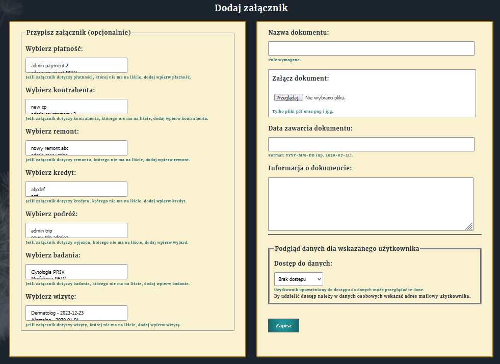

# Memento - app for managing tasks, payments, holidays, and many other daily activities.
Web app for all important plans and things worth to remember (and share, if needed).

## Introduction
###### Memento enables users to keep important things in one place and share choosen information with trusted person.
Keep all your payments in Memento and give access to them to third party in case you can't make your obligations by yourself.
Plan your holidays or appartment renovation. Update "TO-DO" lists or Expense lists. Manage information about your health.

Memento was created solely for programming learning purposes.
It is the first project created in Django framework, first in any framework to be precise, made with huge help from invaluable Stack Overflow service (and many other services and web tutorials too!).

## Version
Project is launched as an alpha version.
There can be some bugs in it and some code sollutions may be outdated (learning curve still in progress).
There are also many ideas to be introduced, like:
* creating callendar app for all dates retained by single user
* implementing Celery library for faster tasks management
* changing CharFields with multiple choices to MultiSelectFields (works on Windows, crashes on Ubuntu)
* periodical clearance of logs
* modification of exportet tables in excel (JavaScript)
and many more.

## Technologies
Project is created with:
* Python 3.10
* Django 5.0
Python libraries required to launch and run the project are listed in requirements.txt file.

## Usabilities
Memento ofers three major usabilities:
1) Information input by user
Each user can create data of his/her own needs within the boundry of application models.

Example of how to add attachment:

2) Information access
User can easily access his/her own data either by viewing or downloading them.

3) Information sharing
User can share selected data with other user.

Hope you will enjoy using Memento service!